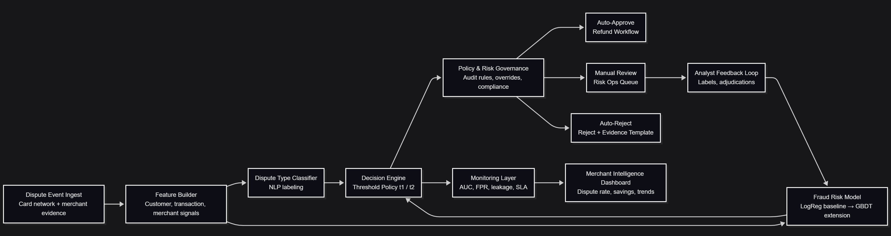

# AI-Driven Dispute Workflow Optimization Engine

An AI-powered dispute automation system that simulates how payment platforms (e.g., Stripe) can automatically triage dispute cases using machine learning risk scoring and threshold optimization to balance fraud risk, operational costs, and automation efficiency.

Live Demo  
https://ai-dispute-resolution-engine.streamlit.app

---

# Project Objective

Dispute resolution in payment platforms requires manual review of millions of cases each month. Manual workflows are expensive, slow, and difficult to scale.

This project simulates an AI-driven dispute workflow that:

• Predicts fraud probability using supervised machine learning  
• Automatically approves low-risk disputes  
• Routes medium-risk cases to manual review  
• Rejects high-risk disputes  

The goal is to determine **optimal automation thresholds that maximize economic value while controlling fraud risk**.

---

# Key Features

• Machine learning fraud risk scoring (logistic regression baseline)  
• Threshold-based workflow automation system  
• Economic simulation for operational cost vs fraud leakage  
• Interactive Streamlit dashboard for threshold experimentation  
• Visual tradeoff analysis between automation rate and net value  

---

# System Architecture

The workflow consists of:

1. Dispute event ingestion  
2. Feature engineering pipeline  
3. Fraud risk prediction model  
4. Threshold policy engine  
5. Automated workflow routing  

Cases are routed based on predicted fraud risk scores.

---

# Machine Learning Model

Model Type  
Supervised classification (Logistic Regression)

Model Performance  
ROC AUC: **0.8008**

Key Features Used

• Transaction amount  
• Customer tenure  
• Prior dispute count  
• Merchant risk tier  
• Transaction velocity  

Synthetic financial data was generated using realistic distributions:

• Lognormal distribution for transaction amounts  
• Gamma distribution for customer tenure  
• Poisson distribution for transaction velocity  

This helps approximate real-world payment behavior.

---

# Workflow Threshold Policy

Three decision zones are used.
Fraud Score < t1 → Auto Approve
t1 ≤ Score ≤ 0.60 → Manual Review
Score > 0.60 → Auto Reject

Optimal threshold discovered:

**t1 = 0.055**

---

# Economic Simulation Results

Automation Rate  
**64.05% of disputes automatically resolved**

Operational Savings  
**$42.6M monthly**

Fraud Leakage Cost  
**$15.4M monthly**

Wrong Rejection Cost  
**$0.12M monthly**

Net Economic Value  
**$27.1M per month**

Annualized Impact  
**~$325M per year**

These results demonstrate how AI-driven workflow automation can significantly improve operational efficiency while managing fraud exposure.

---

# Interactive Dashboard

The project includes a Streamlit application that allows users to:

• Adjust automation thresholds  
• Visualize fraud vs automation tradeoffs  
• Simulate operational impact in real time  

Demo  
https://ai-dispute-resolution-engine.streamlit.app

---

# Project Structure

Optimal threshold discovered:

**t1 = 0.055**

---

# Economic Simulation Results

Automation Rate  
**64.05% of disputes automatically resolved**

Operational Savings  
**$42.6M monthly**

Fraud Leakage Cost  
**$15.4M monthly**

Wrong Rejection Cost  
**$0.12M monthly**

Net Economic Value  
**$27.1M per month**

Annualized Impact  
**~$325M per year**

These results demonstrate how AI-driven workflow automation can significantly improve operational efficiency while managing fraud exposure.

---

# Interactive Dashboard

The project includes a Streamlit application that allows users to:

• Adjust automation thresholds  
• Visualize fraud vs automation tradeoffs  
• Simulate operational impact in real time  

Demo  
https://ai-dispute-resolution-engine.streamlit.app

---

# Project Structure
ai-dispute-resolution-engine
│
├── app.py
├── requirements.txt
├── README.md
│
├── architecture.png
├── portfolio_net_value.png
├── portfolio_automation_rate.png
│
├── assets
│ └── threshold_simulation.gif
│
├── scripts
│ ├── generate_dataset.py
│ ├── train_model.py
│ ├── find_best_threshold.py
│ └── make_portfolio_charts.py
│
└── data
└── scored_disputes_test.csv

## Product Case Study

### Problem Definition

Payment platforms process millions of dispute cases each month. Traditional workflows rely heavily on manual review teams to investigate each case. This leads to:

• High operational costs  
• Slow resolution cycles  
• Inconsistent decision quality  
• Poor scalability during dispute spikes  

As transaction volumes grow, manual workflows become increasingly inefficient.

The product challenge is to design an automated dispute triage system that can scale while maintaining fraud protection and minimizing financial risk.

---

### Product Hypothesis

If dispute cases can be scored using machine learning risk models, then the system can automatically route low-risk disputes to auto-approval and high-risk disputes to rejection while reserving manual review only for uncertain cases.

This approach should:

• Reduce operational workload  
• Accelerate dispute resolution  
• Maintain fraud protection  
• Improve financial recovery rates

---

### Solution Design

The proposed solution introduces an AI-driven workflow engine composed of three components:

1. **Fraud Risk Scoring Model**  
   A supervised ML classifier predicts the probability that a dispute is fraudulent.

2. **Threshold-Based Policy Engine**  
   Risk scores are translated into workflow decisions using configurable thresholds.

3. **Automated Case Routing**  
   Disputes are routed into three decision zones:

   - Low risk → Auto approve  
   - Medium risk → Manual review  
   - High risk → Auto reject  

The threshold policy is optimized through simulation to maximize economic value.

---

### Product Metrics

To evaluate system performance, several key metrics are monitored.

Primary Metrics

• Automation rate  
• Net economic value  
• Fraud leakage cost  
• Manual review workload  

Secondary Metrics

• Model accuracy (AUC)  
• Decision latency  
• Operational throughput

These metrics help product teams balance automation benefits with fraud risk exposure.

---

### Key Product Tradeoff

Increasing automation improves operational efficiency but may increase fraud leakage.

Reducing automation lowers fraud risk but increases operational costs.

The objective is to determine a threshold policy that maximizes **net economic value**, balancing both effects.

---

### Final Outcome

Using simulation on 1M+ synthetic dispute records, the optimal threshold achieved:

• **64% dispute automation**  
• **$27M monthly net value creation**  
• **~$325M annualized financial impact**

This demonstrates the potential value of AI-powered workflow automation for large-scale financial platforms.