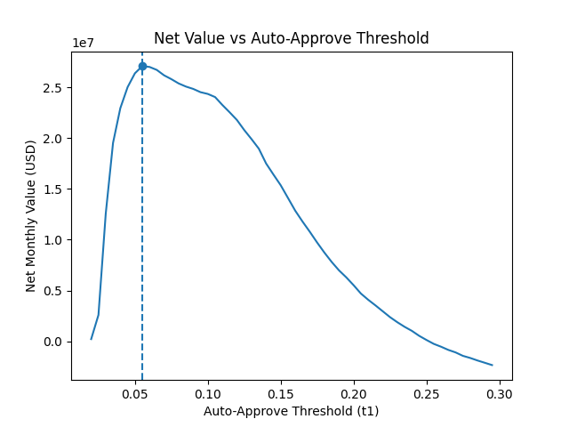
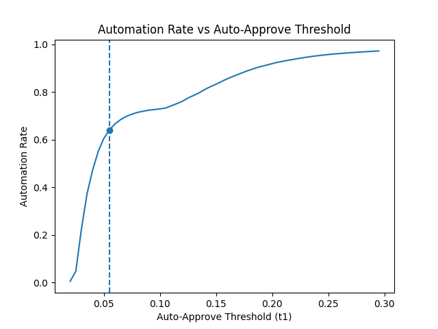
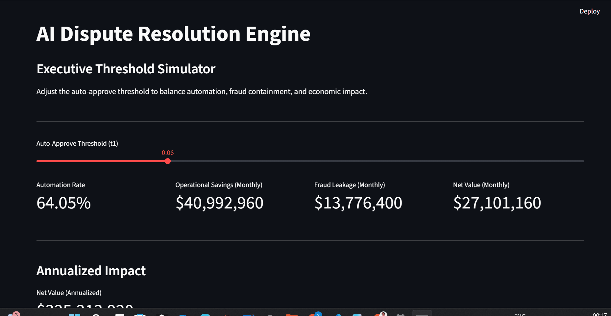

## Results & Demo

### Key Metrics
- Model AUC: **0.8008**
- Optimal Auto-Approve Threshold (t1): **0.055**
- Automation Rate: **64.05%**
- Net Value: **~$27.1M per month (~$325M annually)**

---

### Architecture

---

### Economic Tradeoff Charts

---
## Live Demo

Streamlit App: https://ai-dispute-resolution-engine-zho3kcfunlajv7jep9b7bs.streamlit.app/

---

### Interactive Threshold Simulation

